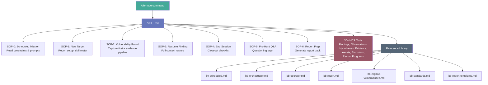
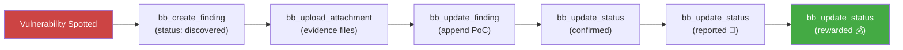

# bb-huge 🤗
> `/bb-huge` — one command. Senior Bug Hunter, loaded.
Not a portal. A **Context Engineering Architecture** that converts your AI agent into a disciplined bug bounty hunter with a single slash command. The web UI is the visible tip — the real power is what happens inside the agent's brain when the skill fires.

<!-- Demo Video -->
| | |
|---|---|
| [](https://github.com/user-attachments/assets/e8f98cdb-d679-4099-be2a-0a6dd4a6acf9) |
|

---

## The Architecture

```
┌─────────────────────────────────────────────────────────────┐
│                    YOUR AI AGENT                             │
│  (gemini-cli / claude-code / codex / emmu / any MCP client) │
└──────────┬─────────────────────────────────────┬────────────┘
           │  "/bb-huge"                         │  "find bugs on
           │  triggers skill                     │   example.com"
           ▼                                     ▼
┌──────────────────────────┐    ┌──────────────────────────────┐
│  SKILL.md                │    │  MCP stdio Server            │
│  • Senior Bug Hunter     │    │  • 30+ tools (CRUD + more)   │
│    persona injected      │    │  • stdio transport           │
│  • 7 SOPs loaded         │◄──►│  • stateless, fast           │
│  • Full tool reference   │    │  • any agent, same API       │
└──────────┬───────────────┘    └──────────┬───────────────────┘
           │                               │
           ▼                               ▼
┌──────────────────────────┐    ┌──────────────────────────────┐
│  references/ (6 files)   │    │  PORTAL (Flask + SQLite)     │
│  • im-scheduled.md       │    │  • Dashboard, Charts         │
│  • bb-orchestrator.md    │    │  • Dashboard, Charts         │
│  • bb-operator.md        │    │  • Findings CRUD             │
│  • bb-recon.md           │    │  • Programs tracking         │
│  • bb-eligible-vulns.md  │    │  • Observations/Hypotheses   │
│  • bb-standards.md       │    │  • Evidence pipeline         │
│  • bb-report-templates   │    │  • Assets & Endpoints        │
└──────────────────────────┘    │  • Recon, Attachments        │
                                │  • REST API                  │
                                │  • Webhooks (Discord/TG)     │
                                └──────────────────────────────┘
```

Two systems, one interface. The **skill layer** gives the agent knowledge & discipline. The **portal layer** gives it persistent memory. They communicate through MCP.

---

## The Signal Pipeline

bb-huge captures bug bounty work at every confidence level, from vague suspicion to confirmed payout:

```
Observation ──promote──► Hypothesis ──promote──► Finding
   (signal)                (candidate)            (confirmed)
```

Each step preserves provenance — a promoted finding keeps a link back to the hypothesis and observation it came from, along with the evidence that supports it.

---

## Why This Works

Every bug hunter has the same problem: **context resets to zero every session**.

You spend 30 minutes re-reading your own notes, re-downloading attachments, trying to remember where you left off. Between sessions, you forget the half-baked hypothesis, the endpoint you were about to fuzz, the parameter that looked interesting.

bb-huge fixes this at the architectural level:

| Problem | How bb-huge solves it |
|---------|----------------------|
| Agent forgets between sessions | Portal stores everything — findings, notes, attachments, evidence |
| You forget hunches and half-baked ideas | Observations & Hypotheses capture signals before they're findings |
| Losing evidence between sessions | Structured evidence records (HTTP pairs, screenshots) linked to findings |
| Disorganized attack surface | Assets & Endpoints track domains, hosts, API routes per program |
| You forget the methodology | Skill injects Senior Bug Hunter SOPs into every new session |
| You waste time on setup | `/bb-huge` command boots everything in one call |
| You skip logging "small" things | Skill enforces *capture-first* discipline |
| Multiple agents, no coordination | Each agent sets its own `agent` field, stats show all activity |
| Writing reports is painful | Report pack generator + ready-to-use report templates |
| Scope confusion | Standards reference loaded at session start |
| Testing blind — no creds, no context | Pre-hunt Q&A asks user once, persists forever |
| Duplicate work | Similarity check scans existing findings/hypotheses before you create |

---

## What `/bb-huge` Actually Loads

When you type the command, the agent's brain gets injected with:



**~2,000 lines of bug bounty knowledge** — every session. The reference library is lazy-loaded (you only pull what you need), but the core skill & tools are always there.

---

## I WANT TO...

<details>
<summary><strong>🚀 Set up bb-huge right now</strong></summary>

### Quick Start

```bash
git clone https://github.com/ShulkwiSEC/bb-huge.git
cd bb-huge
cp .env.example .env
# Edit .env — set SECRET_KEY and DEV_KEY
```

#### Run locally
```bash
python -m venv .venv
source .venv/bin/activate
pip install -r requirements.txt
python run.py
```

#### Or with Docker
```bash
docker compose up -d
```

Open [http://localhost:5000](http://localhost:5000) — enter your `DEV_KEY`.

</details>

<details>
<summary><strong>🤖 Connect my AI agent to bb-huge</strong></summary>

The MCP server (`mcp_server.py`) uses stdio transport. Any MCP-compatible agent connects in seconds.

#### gemini-cli

Add to `.gemini/settings.json` (project or global):

```json
{
  "mcpServers": {
    "bb-huge": {
      "command": "python",
      "args": ["/absolute/path/to/bb-huge/mcp_server.py"],
      "env": {
        "DEV_KEY": "your-dev-key",
        "BB_HUGE_URL": "http://127.0.0.1:5000"
      }
    }
  }
}
```

#### claude-code

Add to `claude_desktop_config.json`:

```json
{
  "mcpServers": {
    "bb-huge": {
      "command": "python",
      "args": ["/absolute/path/to/bb-huge/mcp_server.py"],
      "env": {
        "DEV_KEY": "your-dev-key",
        "BB_HUGE_URL": "http://127.0.0.1:5000"
      }
    }
  }
}
```

See `mcp_config_examples.txt` for codex, emmu, and other agents.

</details>

<details>
<summary><strong>🧠 Load the Senior Bug Hunter skill</strong></summary>

Copy the skill into your agent's skill directory:

```bash
cp -r skills/bb-huge ~/.gemini/skills/
# Project-local also works: .gemini/skills/bb-huge/
```

Now every time you type `/bb-huge`, the agent loads:
- Senior Bug Hunter persona with capture-first discipline
- 7 Standard Operating Procedures (SOP-0 through SOP-6)
- Full tool reference & severity/status guides
- 7 reference files covering methodology, recon, scope, reports, and scheduled missions
- 30+ MCP tools wired to your portal

**The agent doesn't just "know about" bug bounty. It becomes a bug bounty hunter.**

#### ✅ Expected response when loading

After typing `/bb-huge`, the agent will acknowledge the injected methodology and prep the session.

<table>
  <tr>
    <th width="50%">Terminal / Text Output</th>
    <th width="50%">Agent SOP Execution</th>
  </tr>
  <tr>
    <td valign="top">
<pre>
🔵 bb-huge skill loaded
— Senior Bug Hunter mode active
📊 Portal: 42 findings, 5 programs, 3 open observations
🔄 Resuming last session: finding #17
❓ What target are we working on today?
</pre>
    </td>
    <td valign="top">
      
    </td>
  </tr>
</table>

If the agent does NOT acknowledge loading, does NOT run the Session
Initialization Protocol, or seems confused → [run the theory quiz](THEORY_QUIZ.md).

</details>

<details>
<summary><strong>📝 Log a finding immediately</strong></summary>

From your agent:

```
bb_create_finding(title="IDOR on /api/users", target="api.example.com", severity="high")
```

That's it. The MCP server routes it to the portal. No browser, no forms, no friction.

The skill's **#1 rule**: *capture first, enrich later*. A thin entry now beats a perfect entry that never gets written. Fill in CWE, CVSS, PoC, and description as evidence accumulates.



</details>

<details>
<summary><strong>🔍 Search and review findings</strong></summary>

```bash
# From terminal (CLI script)
python skills/bb-huge/scripts/bb.py list --severity critical --status confirmed

# From agent
bb_list_findings(q="xss", severity="high")

# Get full detail
bb_get_finding(id=42)
```

Or open the web UI: [http://localhost:5000/findings](http://localhost:5000/findings) — filter by severity, status, agent, platform. Full-text search. CSV export.

</details>

<details>
<summary><strong>📊 See my stats at a glance</strong></summary>

```bash
# From agent
bb_get_stats()

# From terminal
python skills/bb-huge/scripts/bb.py stats
```

Returns totals by severity, status, and agent. The dashboard also renders bar charts for each dimension.

</details>

<details>
<summary><strong>📎 Attach evidence to a finding</strong></summary>

```bash
# From agent
bb_upload_attachment(id=42, file_path="./burp_request.txt")

# From terminal
python skills/bb-huge/scripts/bb-dump-attachments.py 42
```

Both scripts pull auth from environment variables (`BB_HUGE_URL`, `DEV_KEY`). No credentials hardcoded.

</details>

<details>
<summary><strong>🔄 Resume work on a previous finding</strong></summary>

SOP-3 handles this. The agent:

1. `bb_get_finding(42)` — reads current state, linked hypothesis & evidence
2. `bb_generate_report_context(42)` — gets evidence summary, unresolved gaps
3. `python scripts/bb-dump-attachments.py 42` — pulls all attachments to local disk
4. Reads every attachment to restore full context
5. Gives you a one-paragraph summary of where things stand

Zero context loss between sessions. Even between different agents.

</details>

<details>
<summary><strong>📬 Get notified when things happen</strong></summary>

The portal supports **Discord** and **Telegram** webhooks. Configure in Settings → Webhooks.

The agent can notify on any event:

```bash
bb_notify(event="finding.confirmed", payload={"title": "RCE on admin panel", "message": "Go write the report!"})
```

Webhooks fire automatically on create/status-change if configured.

</details>

<details>
<summary><strong>📋 Track multiple programs</strong></summary>

Programs are first-class citizens. Each program tracks:

- Platform (HackerOne, Bugcrowd, Intigriti, private)
- Scope rules (in-scope / out-of-scope)
- Findings, observations, hypotheses linked to it
- Assets (domains, subdomains, API hosts, mobile apps, repos)
- Endpoints (URL paths with method, protocol, auth info)
- Recon entries (subdomains, technologies, parameters, credentials)

```bash
bb_create_program(name="Acme Corp", platform="HackerOne")
bb_add_recon(program_id=1, category="subdomain", value="admin.acme.com", source="subfinder")
bb_list_programs()
```

</details>

<details>
<summary><strong>🔌 Use the REST API directly</strong></summary>

All endpoints require `X-Dev-Key` header.

```
# Stats
GET    /api/v1/stats

# Enums
GET    /api/v1/enums

# Findings
GET    /api/v1/findings?q=&severity=&status=&agent=&limit=&offset=
POST   /api/v1/findings
GET    /api/v1/findings/<id>
PATCH  /api/v1/findings/<id>
DELETE /api/v1/findings/<id>
PATCH  /api/v1/findings/<id>/status
POST   /api/v1/findings/<id>/notes
DELETE /api/v1/notes/<id>
POST   /api/v1/findings/<id>/attachments
GET    /api/v1/findings/<id>/report-pack
GET    /api/v1/findings/similar?target=&cwe=&title=
PATCH  /api/v1/findings/bulk/status

# Programs
GET    /api/v1/programs
POST   /api/v1/programs
GET    /api/v1/programs/<id>
PATCH  /api/v1/programs/<id>
DELETE /api/v1/programs/<id>
GET    /api/v1/programs/<id>/context
PUT    /api/v1/programs/<id>/context
GET    /api/v1/programs/<id>/brief

# Recon
GET    /api/v1/programs/<id>/recon
POST   /api/v1/programs/<id>/recon
DELETE /api/v1/recon/<id>

# Observations
GET    /api/v1/programs/<id>/observations
POST   /api/v1/programs/<id>/observations
GET    /api/v1/observations/<id>
PATCH  /api/v1/observations/<id>
POST   /api/v1/observations/<id>/promote

# Hypotheses
GET    /api/v1/programs/<id>/hypotheses
POST   /api/v1/programs/<id>/hypotheses
GET    /api/v1/hypotheses/<id>
PATCH  /api/v1/hypotheses/<id>
POST   /api/v1/hypotheses/<id>/promote

# Evidence
GET    /api/v1/programs/<id>/evidence
POST   /api/v1/evidence
GET    /api/v1/evidence/<id>
PATCH  /api/v1/evidence/<id>

# Assets
GET    /api/v1/programs/<id>/assets
POST   /api/v1/programs/<id>/assets
PATCH  /api/v1/assets/<id>
DELETE /api/v1/assets/<id>

# Endpoints
GET    /api/v1/assets/<id>/endpoints
POST   /api/v1/assets/<id>/endpoints
PATCH  /api/v1/endpoints/<id>
DELETE /api/v1/endpoints/<id>

# Notifications
POST   /api/v1/notify

# Similarity check
POST   /api/v1/similarity/check
```

Example:

```bash
curl -X POST http://localhost:5000/api/v1/findings \
  -H "X-Dev-Key: your-dev-key" \
  -H "Content-Type: application/json" \
  -d '{"title":"Reflected XSS in search","target":"app.example.com","severity":"high","cwe":"CWE-79","cvss":7.2}'
```

</details>

<details>
<summary><strong>🧪 Run the Theory Quiz (test your agent)</strong></summary>

After loading `/bb-huge`, run the [Theory Quiz](THEORY_QUIZ.md) to verify
your agent fully understands the skill. 10 questions covering architecture,
SOPs, tools, and workflow.

**Pass threshold:** 9/10 correct = agent is production-ready.
**Fail?** [Open an issue](https://github.com/ShulkwiSEC/bb-huge/issues/new) with
the agent's output and question number.

</details>


<details>
<summary><strong>🕒 Run bb-huge automatically on a schedule</strong></summary>

Because of the `SOP-0` scheduled mission protocol, you can easily run your agent fully hands-free on an hourly or daily basis. The agent will read its constraints from `im-scheduled.md` and execute without human input.

#### 🤖 Native Agent Apps (OpenCode, Codex, etc.)
If your agent's UI already has a built-in task scheduler (like OpenCode), simply configure your time interval and paste this exact prompt into the task configuration:

> /bb-huge This is a scheduled mission. Follow SOP-0 and execute.

---

#### ❗If not  (we can do it manuly)
##### 🐧 Linux / WSL / macOS (Cron for CLI agents)
If you are using CLI agents, open your crontab (`crontab -e`) and add this line to run it at the top of every hour. Adjust the paths to your specific CLI tool and log directory.

#### Run hourly at minute 0
0 * * * * echo "/bb-huge This is a scheduled mission. Follow SOP-0 and execute." | opencode >> ~/.opencode/logs/bb-huge-hourly.log 2>&1

##### 🪟 Windows (PowerShell + Task Scheduler)
1. Create a simple PowerShell script (e.g., `hourly-hunt.ps1`):

" /bb-huge This is a scheduled mission. Follow SOP-0 and execute." | opencode | Out-File -FilePath "$HOME\bb-huge-hourly.log" -Append

2. Open **Task Scheduler**, click **Create Task**.
3. Set Trigger: **Daily**, and check **Repeat task every: 1 hour**.
4. Set Action: **Start a program**, type `powershell.exe`, and add the argument `-ExecutionPolicy Bypass -File C:\path\to\hourly-hunt.ps1`.

*(Note: Replace `opencode` with whichever CLI agent you are using).*
</details>

<details>
<summary><strong>🧪 Test MCP manually</strong></summary>

```bash
echo '{"jsonrpc":"2.0","id":1,"method":"initialize","params":{}}' | \
  DEV_KEY=your-dev-key python mcp_server.py
```

Expect a JSON-RPC response with server capabilities. You can then pipe `tools/list` and `tools/call` messages.

</details>

<details>
<summary><strong>🐳 Run everything in Docker</strong></summary>

```bash
docker compose up -d
```

That's the whole command. The `Dockerfile` + `docker-compose.yml` handle the rest. Portal on `:5000`, ready to connect.

</details>

---

## Everything in the Box

```
bb-huge/
├── app/
│   ├── __init__.py              # Flask app factory
│   ├── models.py                # 11 models: Finding, Attachment, Program,
│   │                            #   ReconEntry, Note, WebhookConfig,
│   │                            #   TargetContext, Observation, Hypothesis,
│   │                            #   EvidenceRecord, Asset, Endpoint
│   ├── migrations.py            # Schema migration functions
│   ├── routes/
│   │   ├── auth.py              # Login / logout
│   │   ├── findings.py          # Web UI: CRUD, upload, CSV, report-pack
│   │   ├── api.py               # REST API (45+ endpoints)
│   │   ├── programs.py          # Program management + observations,
│   │   │                        #   hypotheses, evidence, assets, recon
│   │   └── settings.py          # Webhooks, notes
│   ├── utils.py                 # File validation, webhook dispatch
│   ├── templates/               # 11+ Jinja2 templates (dark theme)
│   └── static/uploads/          # Attachment storage
├── skills/bb-huge/
│   ├── SKILL.md                 # The brain — agent instruction
│   ├── references/
│   │   ├── im-scheduled.md           # Multi-skill routing & coordination
│   │   ├── bb-orchestrator.md           # Multi-skill routing & coordination
│   │   ├── bb-operator.md               # Full hunting methodology
│   │   ├── bb-recon.md                  # Recon playbook + tool commands
│   │   ├── bb-eligible-vulnerabilities.md  # Vulnerability taxonomy & CWE ref
│   │   ├── bb-standards.md              # Scope rules, platform policies
│   │   └── bb-report-templates.md       # Report templates & prep checklist
│   └── scripts/
│       ├── bb.py                        # CLI helper
│       ├── bb-dump-attachments.py       # Download all evidence
│       └── bb-orchestrator-list-skills.py  # List available skills
├── mcp_server.py                # MCP stdio server (30+ tools)
├── THEORY_QUIZ.md               # 10-question agent comprehension test
├── tests/
│   └── test_api.py              # API integration tests
├── config.py                    # App configuration
├── run.py                       # Entry point (Flask / Waitress)
├── requirements.txt
├── Dockerfile
├── docker-compose.yml
├── .env.example
└── mcp_config_examples.txt
```

---

## License

This project is licensed under the MIT License — see the [LICENSE](LICENSE) file for details.
